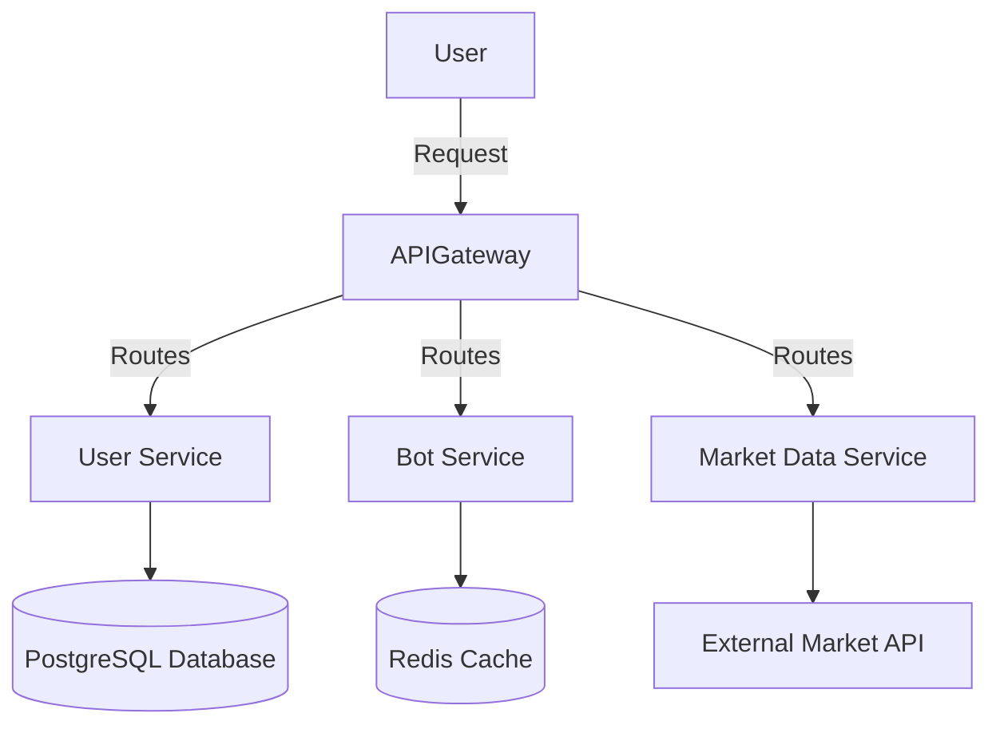

# Microservices Project

This is a microservices-based application designed to handle various aspects of a trading platform, including user management, bot automation, market data processing, portfolio management, and more. Each microservice is implemented using the most suitable framework for its responsibilities.

---

## **Table of Contents**
1. [Overview](#overview)
2. [Architecture](#architecture)
3. [Technologies Used](#technologies-used)
4. [Services](#services)
5. [Getting Started](#getting-started)
6. [Contributing](#contributing)
7. [License](#license)

---

## **Overview**
The project aims to provide a robust and scalable trading platform using modern microservices architecture. Each service is responsible for specific tasks, ensuring modularity, scalability, and maintainability.

---

## **Architecture**
The project is designed as a monorepo, with all microservices contained within the `services` directory. The architecture is containerized using Docker and is ready for deployment on Kubernetes.

Directory Structure:
```
/microservices-project
  /services
    /api-gateway
    /user-service
    /bot-service
    /metrics-service
    /market-data
    /data-science
    /trading-service
    /portfolio
    /notifications
    /subscriptions
    /logs
  /infra
  /docs
```

---

## **Technologies Used**
- **API Gateway**: NestJS
- **User Service**: NestJS
- **Bot Service**: NestJS
- **Metrics Service**: NestJS
- **Market Data Service**: FastAPI
- **Data Science Service**: FastAPI
- **Trading Service**: Go (Gin/Echo)
- **Portfolio Management Service**: Django
- **Notification Service**: Node.js (Express)
- **Subscription & Payment Service**: Spring Boot
- **Logging Service**: Flask
- **Infrastructure**: Docker, Kubernetes, Redis, PostgreSQL

---

## **Services**
### **Core Services**
1. **User Service**: User management and authentication.
2. **Bot Service**: Bot creation and management.
3. **Metrics Service**: Performance tracking and metrics.

### **Specialized Services**
1. **Market Data Service**: Market data collection and processing.
2. **Data Science Service**: Backtesting, optimization, and predictions.
3. **Trading Service**: Execution of trades.

### **Additional Services**
1. **Portfolio Management Service**: Managing user portfolios.
2. **Notification Service**: Sending notifications and alerts.
3. **Subscription & Payment Service**: Managing subscriptions and payments.
4. **Logging Service**: Logging and monitoring.

---
## **Graph App-Map**


---

## **API Gateway Features**
- **Authentication**: Validates JWT tokens for secure communication.
- **Logging**: Uses `nestjs-pino` for structured JSON logs.
- **Routing**: Proxies requests to the appropriate microservices.
- **Future-proofing**: Modular design to accommodate new microservices easily.

---

## **Getting Started**
1. Clone the repository:
   ```bash
   git clone https://github.com/your-username/microservices-project.git
   cd microservices-project
   ```
2. Set up Docker:
   ```bash
   docker-compose -f infra/docker-compose.yml up --build
   ```
3. Access services via API Gateway at `http://localhost:3000`.

---

## **Contributing**
1. Fork the repository.
2. Create a new branch for your feature:
   ```bash
   git checkout -b feature-name
   ```
3. Commit your changes:
   ```bash
   git commit -m "Add new feature"
   ```
4. Push to the branch:
   ```bash
   git push origin feature-name
   ```
5. Submit a pull request.

---

## **License**
This project is licensed under the [MIT License](LICENSE).

---

## **Contact**
For inquiries or support, contact [your-email@example.com].
